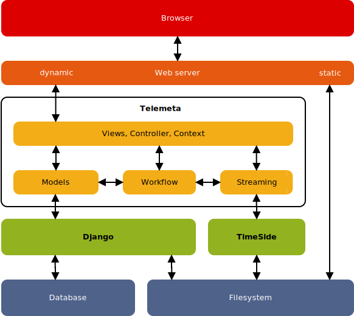
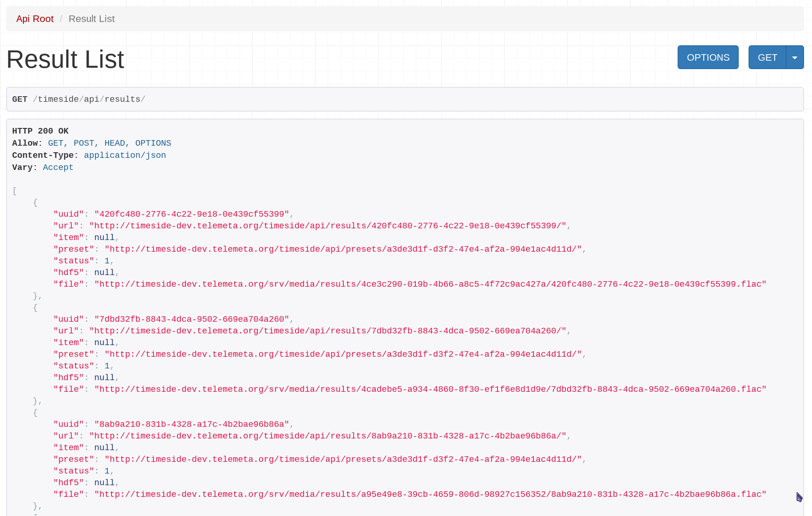
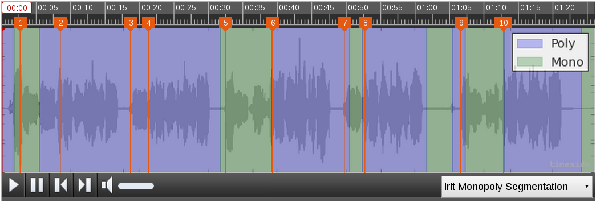
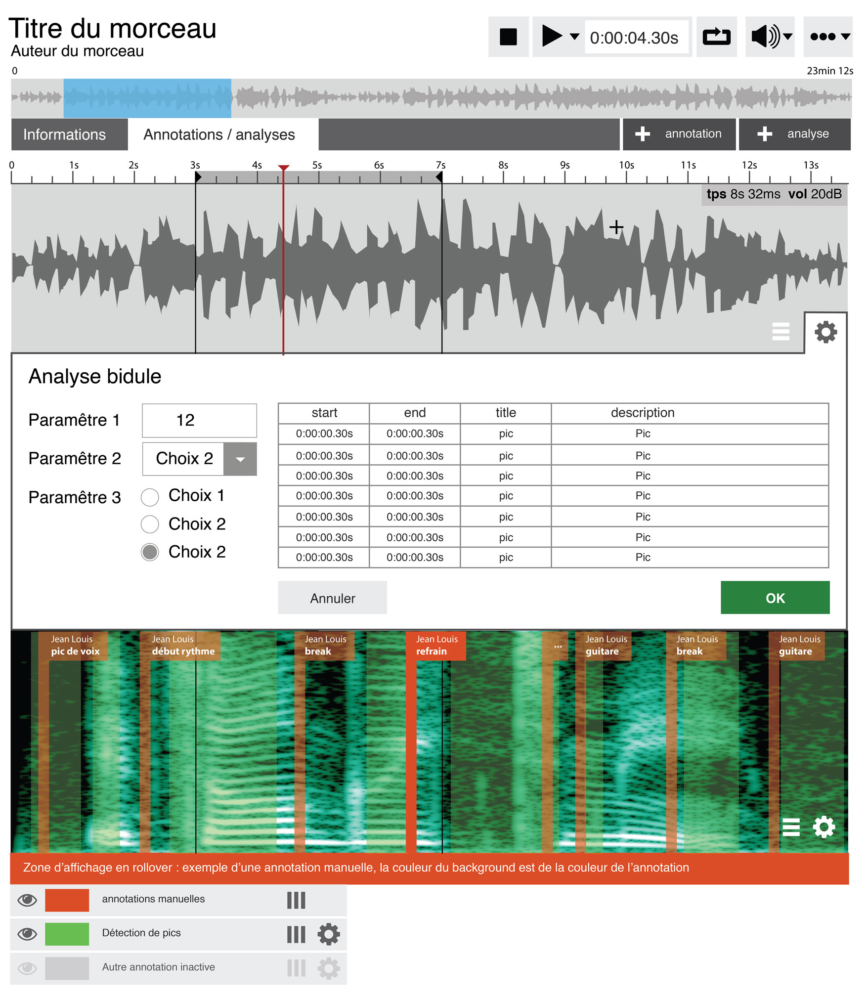

class: center, middle, ircam

# TimeSide

##open audio processing framework for the web


###Guillaume Pellerin, Antoine Grandry, Martin Desrumaux - IRCAM<br>

### Séminaire STMS 14/10/2020 @ IRCAM

---
class: ircam

#Outline

- Intro (GP)
- Historique du projet TimeSide (GP)
- Framework (GP)
- Server (AG)
- Player v2 (MD)
- Perspectives

---
class: ircam, tight

#TimeSide

##open audio processing framework for the web

https://github.com/Parisson/TimeSide

##Goals

* *Do* asynchronous and fast audio processing with **Python**,
* *Decode* audio frames from *any* audio or video media format into numpy arrays,
* *Analyze* audio content with some state-of-the-art audio feature extraction libraries like Aubio, Yaafe and VAMP as well as some pure python processors
* *Visualize* sounds with various fancy waveforms, spectrograms and other cool graphers,
* *Transcode* audio data in various media formats and stream them through web apps,
* *Serialize* feature analysis data through various portable formats,
* *Playback* and *interact* *on demand* through a smart high-level HTML5 extensible player,
* *Index*, *tag* and *annotate* audio archives with semantic metadata (see `Telemeta <http://telemeta.org>`__ which embed TimeSide).
* *Deploy* and *scale* your own audio processing engine through any infrastructure

---
class: ircam

#TimeSide

##open audio processing framework for the web

https://github.com/Parisson/TimeSide

##Use cases

- Scaled audio processing (filtering, transcoding, machine learning, etc...)
- Audio process prototyping
- Audio dynamic visualization
- Automatic segmentation and labelling synchronized with audio events
- Collaborative annotation
- Audio web services

---
class: ircam

#TimeSide

##Short story

- 2007 : Telemeta = Parisson + CREM (archives sonores du CNRS / Musée de l'Homme)
- 2010 : TimeSide separation as a autonomous library and then a framework with a plugin oriented architecure
- 2011 : Telemeta release v1.0 and production of http://archives.crem-cnrs.fr/
- 2013 : DIADEMS project (ANR CONTINT)
- 2015 : TimeSide API and server prototype
- 2016 : WASABI Project (ANR Générique)
- various related projects....

---
class: ircam
#Telemeta / TimeSide integration

.pull-left[


###Collaborative multimedia asset management system

https://github.com/Parisson/Telemeta

###MIR + Musicology + Archiving = MIRchiving !

###>>> active learning
]

.pull-right[
.right[]
]


---
class: ircam
#Telemeta architecure

.center-50[

]

---
class: ircam
#TimeSide

.pull-left-30[
##Architecture
- streaming oriented core engine
- data persistence
]

.pull-right-70[
.right[]
]

---
class: ircam

.pull-left-30[
#TimeSide

##Architecture
- streaming oriented core engine
- data persistence
- processing API and namespace
]

.pull-right-70[
```python
class DummyAnalyzer(Analyzer):
    """A dummy analyzer returning random samples from audio frames"""
    implements(IAnalyzer)

    @interfacedoc
    def setup(self, channels=None, samplerate=None, blocksize=None, totalframes=None):
        super(DummyAnalyzer, self).setup(channels, samplerate, blocksize, totalframes)
        self.values = numpy.array([0])

    @staticmethod
    @interfacedoc
    def id():
        return "dummy"

    @staticmethod
    @interfacedoc
    def name():
        return "Dummy analyzer"

    @staticmethod
    @interfacedoc
    def unit():
        return "None"

    def process(self, frames, eod=False):
        size = frames.size
        if size:
            index = numpy.random.randint(0, size, 1)
            self.values = numpy.append(self.values, frames[index])
        return frames, eod

    def post_process(self):
        result = self.new_result(data_mode='value', time_mode='global')
        result.data_object.value = self.values
        self.add_result(result)

```
]

---
class: ircam
#TimeSide

.pull-left-30[
##Architecture
- streaming oriented core engine
- data persistence
- processing API and namespace
- docker packaged
- fully scalable
]

.pull-right-70[
```bash
$ git clone --recursive https://github.com/Parisson/TimeSide.git
$ docker-compose up
$ docker-compose scale worker 1024
```

```python
$ docker-compose run app python manage.py shell
>>> from timeside.models import Task
>>> tasks = Task.objects.all()
>>> for task in tasks:
>>>     task.run()
```
]

---
class: ircam, tight
#TimeSide

##Plugins

https://github.com/Parisson/TimeSide

https://github.com/DIADEMS/timeside-diadems

.pull-left[
- FileDecoder
- ArrayDecoder
- LiveDecoder
- VorbisEncoder
- WavEncoder
- Mp3Encoder
- FlacEncoder
- OpusEncoder
- Mp4Encoder
- AacEncoder
]

.pull-right[
- Aubio (Temporal, Pitch, etc)
- Yaafe (graph oriented)
- librosa
- **VampPyHost**
- **Essentia bridge**
- **Speech detection**
- **Music detection**
- **Singing voice detection**
- **Monophony / Polyphony**
- **Dissonance**
- **Timbre Toolbox**
- etc... (experimental)
]

---
class: ircam
#TimeSide

.pull-left-30[
##Resful API

http://timeside-dev.telemeta.org/timeside/api/

- based on Django Rest Framework (extensible)
- streaming oriented (audio and data)
- user presets
]

.pull-right-70[
.right[]
]

---
class: ircam
#TimeSide

.pull-left-30[
##Player (v1, SoundManager2)

- on demand processing
- simple marker annotation
- bitmap image cache only
]

.pull-right-70[
.right[]
]

---
class: ircam

.pull-left[
#TimeSide

##Player v2 (Web Audio, prototype)

###Assumption : NO audio duration limit

###Constraint : user data persistence

- zooming
- packet streaming (audio & data)
- multiple user annotations and analysis tracks
- dynamic data rendering
]

.pull-right[
.right[]
]

---
class: center, middle, ircam

# TimeSide projects

---
class: ircam, tight

# DIADEMS project

##Description, Indexation, Access to Sound and Ethnomusicological Documents

- 36 month reearch project from 2012 to 2016
- 850k€ project granted by the french Research National Agency

https://www.irit.fr/recherches/SAMOVA/DIADEMS/en/welcome/

##Consortium

- CREM : Centre de Recherche en Ethnomusicologie (Ethnomusicology Research Center, Paris, France)
- LAM : Equipe Lutherie, Acoustique et Musique de l'IJLRDA (Paris, France)
- MNHN : Museum National d'Histoire Naturelle (National Museum of Biology, Paris, France)
- IRIT : Institut de Recherche en Informatique de Toulouse (Toulouse, France)
- LIMSI : Laboratoire d'Informatique pour la Mécanique et les Sciences de l'Ingénieur (Orsay, France)
- LABRI : Laboratoire Bordelais de Recherche en Informatique (Bordeaux, France)
- Parisson : Open development agency for audio science and arts (Paris, France)

---
class: ircam, tight

# DIADEMS project

### Analyzers

https://github.com/ANR-DIADEMS/timeside-diadems

### Platform

http://diadems.telemeta.org

### Examples

http://diadems.telemeta.org/archives/items/CNRSMH_I_2013_201_001_01/
http://diadems.telemeta.org/archives/items/CNRSMH_I_2000_008_001_04/


---
class: ircam, tight

#WASABI project

##Web Audio and SemAntic in the Browser for Indexation

- 42 months from 2016 Q4 to april 2020 Q2
- 750 k€ project granted by the french Research National Agency

## Consortium

- INRIA (I3S)
- IRCAM (MIR + Musicology + Library)
- Deezer R&D
- Radio France Library
- Parisson

---
class: ircam

#WASABI project

##Objectives

- Propose some new methodologies to index music in the web and audio context
- Link semantics (linked metadata) + acoustics (MIR data) + machine learning
- Develop and publish some open source web services through original APIs

##Use cases

- augmented web music browsing
- data journalism
- music composing through big data
- plagiarism or influence detection

---
class: ircam
#WASABI

##Innovative user experience / use cases

###Targets: composers, musicologists, data journalists, music schools, music engineer schools, streaming services.

###Application expected results (using WebAudio extensively)

- A full web app to browse multidimensional data (I3S)
- Collaborative Web tools for automatic, semi-automatic and manual audio indexing (Parisson, IRCAM)
- Mixing table / multitrack player, chainable high-level audio effects, guitar amp simulators, interactive audio music browser (I3S)
- Search engine driven by audio (midi input, audio extracts) (IRCAM, I3S)
- improving production metadata access and recommandation (Deezer, Radio France)
- Interactive tutorials (music and sound engineer schools)

---
class: ircam

# Conclusion

##WASABI will bring acoustics and semantics together

###2 million song dataset, mixing cultural and audio data, constantly being enriched

- Ongoing project, at its beginning.
- First of its kind to include both cultural + MIR + lyrics NLP analysis
- Search engine + GUI already online, will be enhanced and add many facets and WebAudio client apps
- Open source bricks
- REST API, SPARQL endpoint
- Knowledge database usable for reasoning on datas
- TRY IT! https://wasabi.i3s.unice.fr

---
class: ircam, tight

#Other TimeSide related projects

- DaCaRyh (Labex) - Steel band history
  - C4DM : Centre for Digital Music at Queen Mary University (London, UK)
  - CREM
  - Parisson

- NYU / CREM - Arabic rythm analysis
  - NYU : New York University
  - CREM
  - Parisson

- KAMoulox (ANR) - audio source separation
    - INRIA
    - Parisson
    - http://kamoulox.telemeta.org/
    - http://kamoulox.telemeta.org/timeside/api/results/

---
class: ircam

#Future of TimeSide

- Full autonomous audio analyzing Web service
- More research project implying the framework
- Dual licencing:
    - open source community release of the core framework (AGPL)
    - proprietary entreprise release (SATT Lutech / Parisson / IRCAM) ?
- Industrial use cases:
    - MIRchiving (Telemeta, BNF, archives internationales)
    - Metadata enhanced musical streaming services (Qwant, Deezer, SoundCloud)
    - Digitization and media packaging services (VectraCom, VDN, Gecko)

---
class: center, middle, ircam

# Thanks !
<hr>

##Guillaume Pellerin, IRCAM, France

###guillaume.pellerin@ircam.fr / @yomguy
